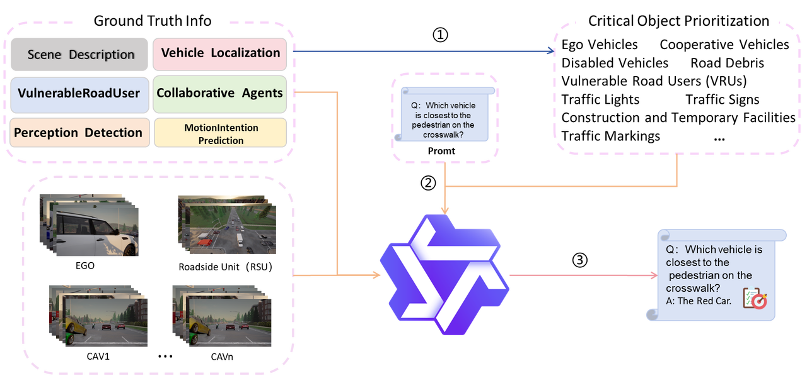

# <i>CoRTSG-QA: A Large-Scale Autonomous Driving V2X Visual Question Answering Dataset</i>
<strong>CoRTSG-QA</strong> is a large-scale visual question answering dataset designed for autonomous driving scenarios with Vehicle-to-Everything (V2X) perception. Built upon multi-view camera streams and collaborative perception data, it supports research on joint scene understanding, reasoning about traffic interactions, and answering natural language questions across diverse driving conditions. The dataset enables the development of robust VQA models that can leverage both onboard visual information and cross-vehicle communication to interpret complex road environments, making it a valuable resource for advancing safe and intelligent autonomous systems.



The preprint paper is published [here]().

The generated and rendered concrete scenarios can be downloaded in [OpenDataLab](https://opendatalab.com/Rongsong/CoRTSG). Update the dataset as [this](./docs/update_annotation.md) if you downloaded the non-fix version and would like to use camera's extrinsic.

# Summary

Utilizing traffic crashes in which vision of driver of subejct/ego vehicle is obstructed, **11** risky functional scenarios are constructed. For each functional scenario, a logical scenario is determined. With the help of car-follwoing spacings, individual perception performance analysis, **17490** risky concrete scenarios are generated.

These risky concrete scenarios had been rendered using [CARLA](https://carla.org/) simulator. One can download them in [OpenDataLab](https://opendatalab.com/Rongsong/CoRTSG) for testing specific cooperative perception algorithms.

**Stats of Generated Risky Scenarios**
| Functional scenario | V2X | Map | Triples of (ego, occluders, key occludee) | No. of concrete scenarios |QA|
| ---------       | ----  | ----   | ---   | ---  | ---- |
| S1: juncrush    | V2V&I | Town05 | 3762  | 1386 | 1369 |
| S2: segrush     | V2V   | Town03 | 1428  | 729  | 200 |
| S3: segrush_v2  | V2V   | Town03 | 3057  | 1387 | 1370 |
| S4: ruralcurve  | V2V   | Town07 | 3657  | 1667 | 200 |
| S5: juncreverse | V2V&I | Town05 | 15246 | 1361 | / |
| S6: juncturn    | V2V&I | Town05 | 64008 | 4396 | / |
| S7: juncsame    | V2V&I | Town05 | 75600 | 1132 | / |
| S8: parkingexit | V2V   | Town07 | 2040  | 712  | 200 |
| S9: overtake    | V2V   | Town01 | 73080 | 656  | 200 |
| S10: lanechange | V2V   | Town10HD | 37980 | 1392 | 200|
| S11: onramp     | V2V   | Town06  | 5012 | 2672 | 200 |
| Overall         |       |        | 285044 | 17490 | 3939 |

# Usage

## Installation

Clone this repo into your local machine and install it:
```bash
cd scripts/
https://github.com/NanShenname/CoRTSG-QA.git

cd CoRTSG
pip install -r requirements.txt
python setup.py develop   # or pip install -e .
```

If you want to render the concrete scenarios to obtain images and point clouds, [CARLA==0.9.12](https://carla.org/) is needed.

If you want to collect training data, [SUMO>=1.18.0](https://sumo.dlr.de/docs/index.html) is needed.

## Running

### Data collection

This repo supports collecting training data in [OPV2V](https://mobility-lab.seas.ucla.edu/opv2v/) format for cooperative perception in V2X environment. Learn more about data collection [here](./coriskyscene/data_collection/README.md).

Upon this repo, [Multi-V2X](https://github.com/RadetzkyLi/Multi-V2X), a  multi-modal, multi-penetration-rate dataset for cooperative perception has been collected. 

### Risky scenario generation

**First**: Select locations in OpenDRIVE maps and specify hyper-parameters so as to obtain a logical scenario from a functional scenario.

**Second**: subclass ``BaseSceneGenerator`` or ``BaseSceneSequentialGenerator`` to create a generator that is responsible for generating concrete scenarios. 

Generators of 11 logical scenario (one for each functional scenario) had been completed and one can just run the following to repeat (if you want) the overtake scenario:
```bash
cd CoRTSG/coriskyscene/scene_generation/generator

python segment_overtake_scene_generator.py
```
By default, the results would be saved in a ``.json`` file in ``CoRTSG/coriskyscene/scene_generation/data/``.

**Note**: the time axis is not considered and thus a concrete scenario is a scene in the context.

### Risky scenario visualization

Before rendering, by viewing the scenario from top to down in a 2D image, one can check manually whether the generated scenarios are resonable and natural. Refer to this [tutorial](./examples/tutorials/visualize_scene.ipynb).

### Risky scenario rendering

After obtaining risky scenarios (stored in ``.json`` file), render them to get images and point clouds from various agents.
Modify the following variables in ``coriskyscene/scene_rendering/data_protocal.yaml``:
- ``output_dir``: change it to your preferred one.
- ``map_name``: change it to be consistent with risky traffic scenarios.

Then, run:
```bash
export CARLA_HOME="Your CARLA installation directory"

cd CoRTSG/coriskyscene/scene_rendering
python render_scene.py --carla-cfg-file data_protocal.yaml --scene-path ${YOUR_SCENE_PATH} --gpu-id ${GPU_ID}
```
By default, ``${YOUR_SCENE_PATH}`` lies in ``CoRTSG/coriskyscene/scene_generation/data/``. One can have a try using ``example.json`` in this directory. 

**Note**:  This ``${GPU_ID}`` may be inconsistent with results of ``nvidia-smi``, so try it manually on your server. (default: 3, GPU 0 on my server).

### Risky scenario-based testing

Based on [OpenCOOD](https://github.com/DerrickXuNu/OpenCOOD), to let it suitable for our testing purposes, the authors made some improvements:
- compatible for various datasets. Now, [OPV2V](https://mobility-lab.seas.ucla.edu/opv2v/), [V2XSet](https://github.com/DerrickXuNu/v2x-vit), [V2V4Real](https://github.com/ucla-mobility/V2V4Real), [Multi-V2X](https://github.com/RadetzkyLi/Multi-V2X) and our [CoRTSG](https://github.com/RadetzkyLi/CoRTSG) are supported.
- more metrics: accuracy, bandwith and safety gain are supported.

To test the pretrained models on Multi-V2X, first download the model files and `pr_config_list_15k.json` from [OpenDataLab](https://opendatalab.com/Rongsong/Multi-V2X/tree/main/raw/weights). Then modify the associated `config.yaml`: replace `pr_setting.path` with your path of `pr_config_list_15k.json`. Run:
```bash
python ${OpenCOOD}/opencood/tools/inference.py --model_dir ${MODEL_DIR} --fusion_method ${FUSION_METHOD} --dataset_format "test" --dataset_root ${ROOT_DIR}
```


# Contact
If you have any questions, feel free to open an issue.

# Citations
If you find our work useful in your research, feel free to give us a cite:
```BibTex
@inproceedings{nanyangchen2026covqa,
      title={CoVQA: A vision-language framework and benchmark for V2X collaborative driving via visual question answering}, 
      author={Nan, Yangchen and Gong, Peize and Li, Chengxiang and Liu, Yue and Zhao, Hongbo and Zhang, Wanyue and Ye, Chenglong and Dai, Xingyuan and Lv, Yisheng},
      booktitle={Proc. IEEE Int. Conf. Intell. Transp. Syst. (ITSC)},
      year={2026},
      note={to be published}
}
```
